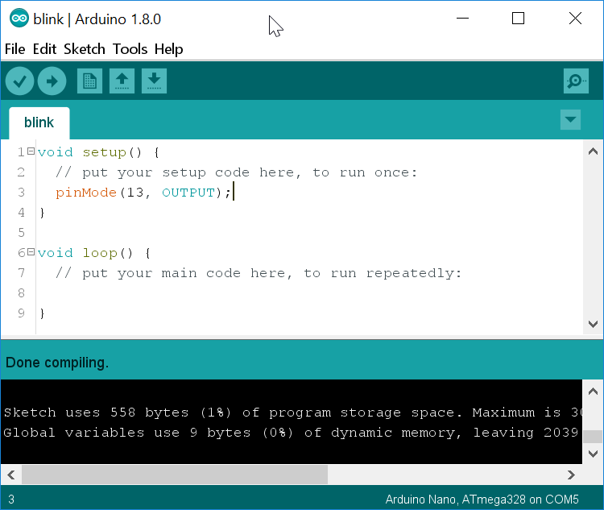
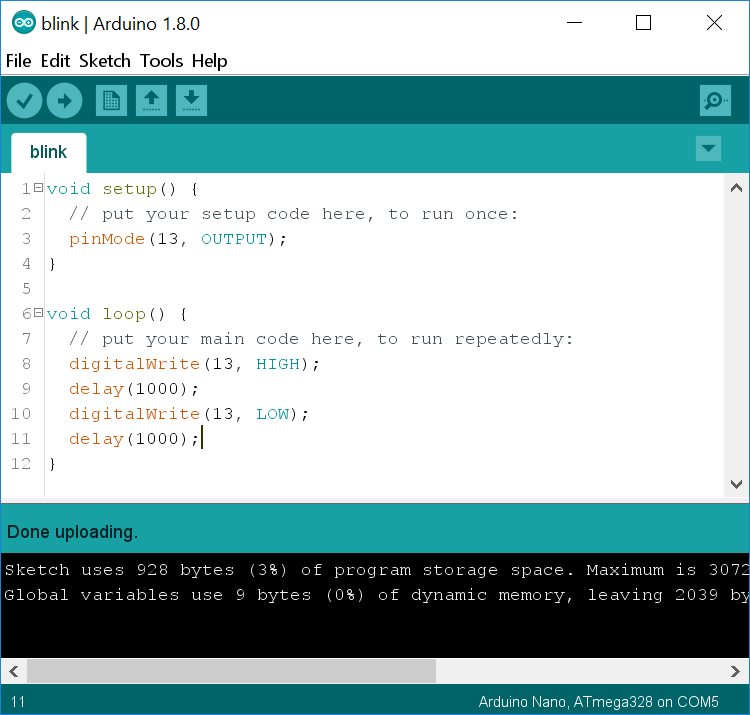

Blink 
======

One of the advantages of programming with the Arduino platform is that
you can often see immediate results from your code. We\'re going to
create a program that causes LEDs to blink, both on the board and on a
separate breadboard.\

Checkpoint 1: Connect Your Arduino 
----------------------------------------------------------------

Get an Arduino from the table at the back of the room and a USB-A to
USB-B cable. Connect it to your laptop and open the Arduino IDE. If it
does not automatically open an empty sketch (program) then go to the
*File* menu and select *New*. Make sure you have the correct port
selected.\

Raise your hand and have Mr. Olinda verify this checkpoint.

Checkpoint 2: Output Pin 
-----------------------------------------------------

For the program to work, you need to designate one pin as an output pin.
The Arduino Uno has a built-in LED attached to pin 13, which is what we
will use for now. On line three of your empty program, press Tab and
type:

`pinMode(13, OUTPUT);`

This tells the board to set pin 13 to output. Go to the *Tools* menu
and choose *Auto Format*. Then verify your code to make sure you
haven\'t made any syntax errors. At this point your code won\'t do
anything, so do not upload it yet. Just save it as *blink* in your
*cspProjects/arduino* folder. Then add and commit it to version
control.\

What other mode do you think you can set pins to?\

Raise your hand and have Mr. Olinda verify this checkpoint.

Checkpoint 3: High and Low 
--------------------------------------------------------

Now let\'s add the code that will run continuously as long as your
Arduino is powered on. Go to line eight and press Tab. Then type:

`digitalWrite(13, HIGH);`

`delay(1000);`

`digitalWrite(13, LOW);`

`delay(1000);`

Go to the *Tools* menu and choose *Auto Format*. Then verify your
code to make sure you haven\'t made any syntax errors. Save it, and then
add and commit it to version control. Then upload it and see if the
orange LED blinks on and off. If so, you\'ve entered the code correctly.
If not, go back and check each line.

What part or parts of your code do you think turns on the light? What
part or parts turns it off? What part or parts control the duration of
the blink? What unit do you think is used to measure time?\

Raise your hand and have Mr. Olinda verify this checkpoint.

Checkpoint 4: Timing 
-------------------------------------------------

The way your program works right now, your LED is on for one second and
off for one second. Modify it so that it is on for one second and off
for two. The amount of time an LED is on during one cycle is called the
duty cycle. So a duty cycle of 50% means that the light is on half the
duration of a cycle. Try at least three other combinations of timings.
Be prepared to demonstrate changing the timings for Mr. Olinda and
express them both in seconds as well as duty cycles.\

Raise your hand and have Mr. Olinda verify this checkpoint.

Checkpoint 5: Patterns 
----------------------------------------------------

Now that you know how to adjust the timing of the lights, add extra
lines of code to turn the light on and off in different patterns. You
must create a pattern that uses at least four ON/OFF pairs, and each
pair must be different.\

Raise your hand and have Mr. Olinda verify this checkpoint.

Checkpoint 6: Commenting Your Code
---------------------------------------------------------------

Go ahead and add comments on each line of code, explaining what you
think each line does. Comments are preceded by `//` so that the compiler
knows they\'re not supposed to be code. You can add comments after code
or on their own lines.\

Raise your hand and have Mr. Olinda verify this checkpoint.

Checkpoint 7: External LED Setup
-------------------------------------------------------------

Now we are going to modify the program to turn an external LED on and
off. Go to the supply bin and get a breadboard, two wires, a 1K resistor
(black, red, and gold stripes), and a red LED. Breadboards are small,
rectangular pieces of plastic with holes in them where you can quickly
add and remove wires and other parts to try out different circuits. The
wires will carry the current from the board to the LED, and the resistor
simply protects the LED from overheating.\

Then, unplug and set up your Arduino to match the diagram below. Make
sure you use exactly the same pins as the diagram. Notice that one of
the pins on the LED is longer. That pin is bent in the diagram.\

If you plug your Arduino back in, you\'ll notice it does not do anything
new. Go ahead and edit your code to make the external LED blink. Once it
does, save your code, and add and commit it to version control.\

Raise your hand and have Mr. Olinda verify this checkpoint.
