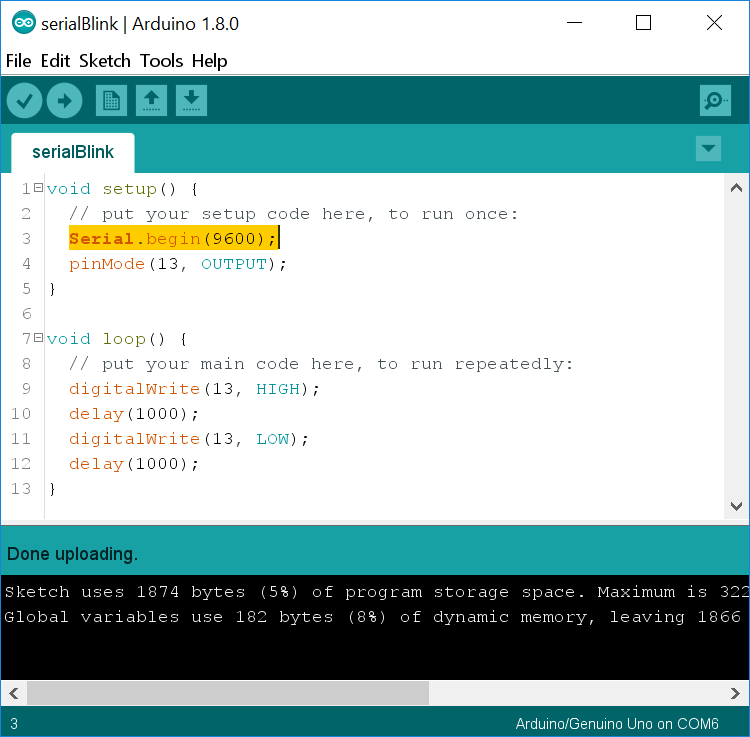
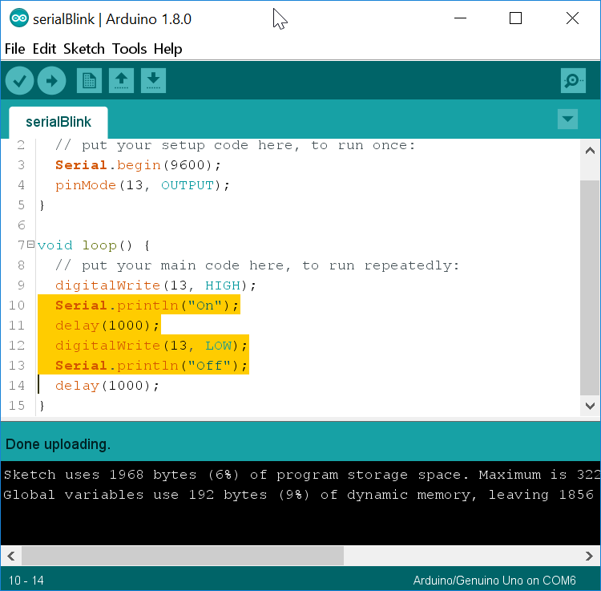
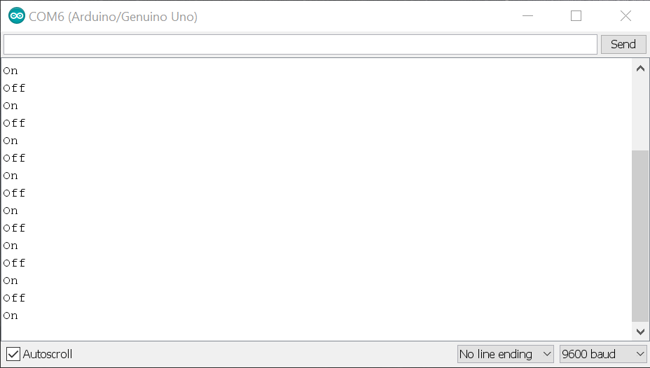
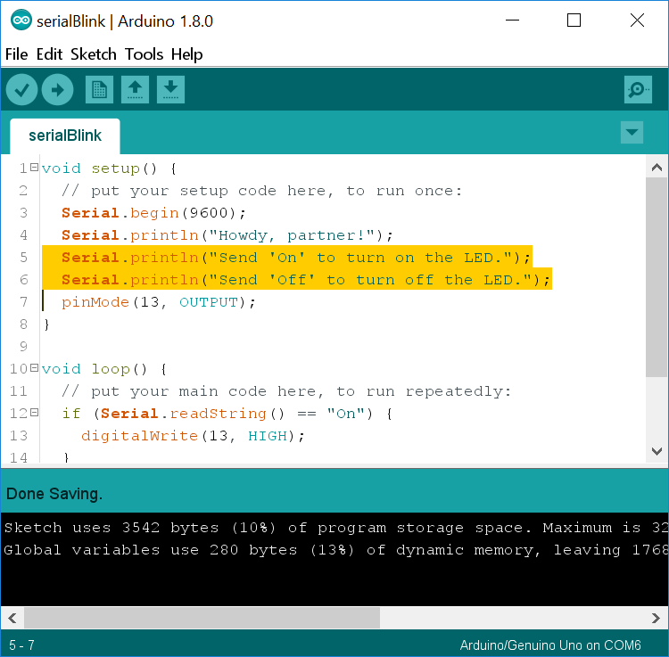
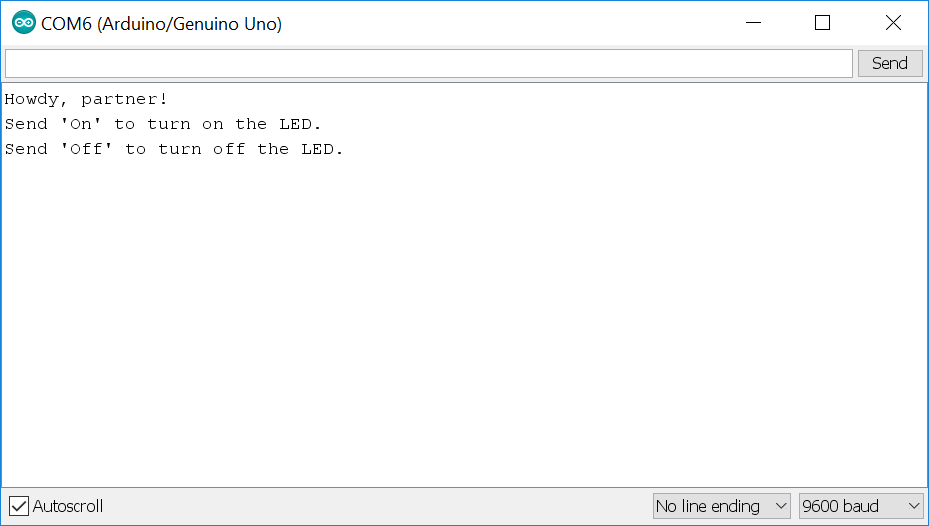
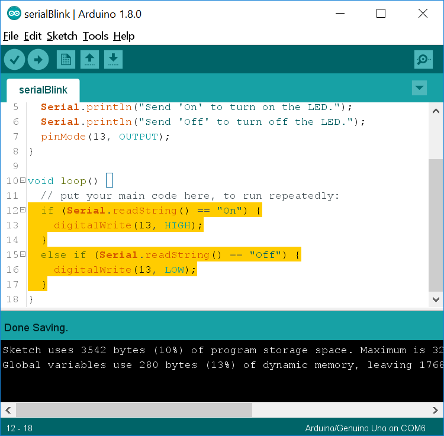
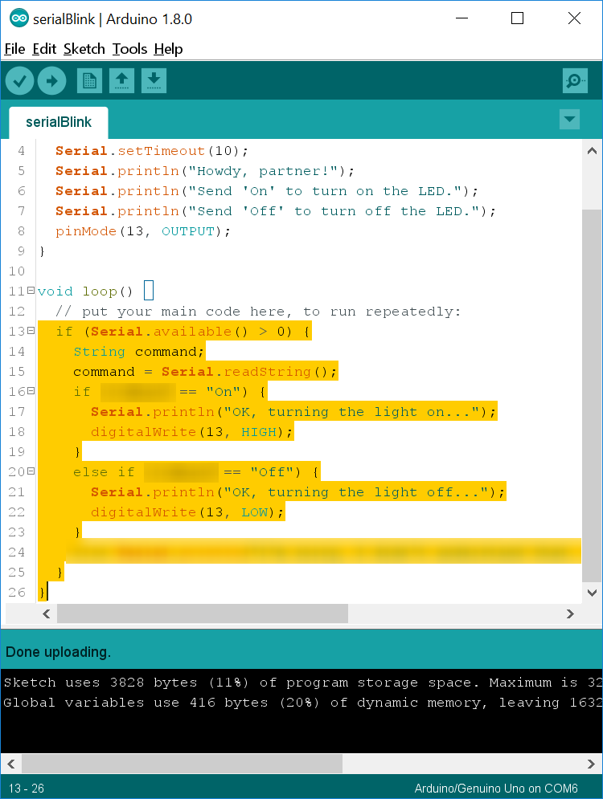

Serial 
=======

[Your Arduino has a serial
connection](https://www.arduino.cc/en/Reference/Serial) for
communicating with your computer or with other devices. Usually you\'ll
use the built-in serial port in the USB port, but you can also connect
to pins 0 and 1 to communicate over serial. Be careful when doing this
since using the wrong voltages can damage your Arduino. During this
lesson I link to several more detailed explanations of certain
functions. If you\'re confused about what they do, try reading those
before you ask a question.\

Checkpoint 1: Connect Your Arduino 
----------------------------------

Get your supplies and take out only the Arduino and the USB cable.
Connect your Arduino to your laptop, open the Arduino IDE, and make sure
the correct port is selected.\

<p class="checkpoint">Raise your hand and have Mr. Olinda verify this checkpoint.</p>

Checkpoint 2: Blink, But Better 
-------------------------------

Create a new Arduino program from the file menu and write the code to
make pin 13 blink on and off with a 1 second delay. Upload the program
to make sure it works and then save the program as *serialBlink* in your
*\~/projects/arduino/* directory. Then add and commit it to version
control using a proper commit message.\

<p class="checkpoint">Raise your hand and have Mr. Olinda verify this checkpoint.</p>

Checkpoint 3: A Little Serial 
-----------------------------

Now you need to add the following statement to the `void setup()` function:

```
Serial.begin(9600);
```



This activates the serial connection in your USB port and sets the baud
rate to 9,600. [This link provides a more detailed explanation of baud rates](http://electronicdesign.com/communications/what-s-difference-between-bit-rate-and-baud-rate#4),
but it basically means the number of signals that can be sent per
second.\

Add the following code to the `void loop()` function right after the code
that turns the LED on:

```
Serial.println(\"On\");
```

Then add the following code to the `void loop()` function right after the
code that turns the LED off:

```
Serial.println(\"Off\");\
```



Upload the program to your Arduino and press the magnifying glass icon
in the upper right corner to open your serial monitor. You should start
to see a series of messages appear.



If you do, then save your program, add, and commit. If not, go back and
review the instructions to make sure you\'ve done the steps correctly.\

<p class="checkpoint">Raise your hand and have Mr. Olinda verify this checkpoint.</p>

Checkpoint 4: Make Friends 
-------------------------------------------------------

Use the [Serial.println()](https://www.arduino.cc/en/Serial/Println)
functions to make your Arduino say something nice to the user when it
first boots up. If it works, then save, add, and commit.\

<p class="checkpoint">Raise your hand and have Mr. Olinda verify this checkpoint.</p>

Checkpoint 5: Lines 
-------------------------------------------------

Change all the `Serial.println()` functions to
[Serial.print()](https://www.arduino.cc/en/Serial/Print) functions and
see what happens in the serial monitor when you upload your program.
What is the difference between println and print?\

<p class="checkpoint">Raise your hand and have Mr. Olinda verify this checkpoint.</p>

Checkpoint 6: You\'re in Charge 
-------------------------------------------------------------

Go ahead and change the `Serial.print()` functions back to
`Serial.println()`. Now you\'re going to modify your program to turn the
light on and off in response to commands you send via the serial
monitor. First, add the following code underneath your friendly message:

```
Serial.println("Send 'On' to turn on the LED.");
Serial.println("Send 'Off' to turn off the LED.");
```



Don\'t change anything else yet. Open your serial monitor and upload the
program. As soon as the program uploads you should see something like
this:



If you see this, go ahead and save, add, and commit.\

<p class="checkpoint">Raise your hand and have Mr. Olinda verify this checkpoint.</p>

Checkpoint 7: if / else 
-----------------------

Now you\'re going to create an [`if / else`](https://www.arduino.cc/en/Reference/Else) block in your
`void loop()` function that will control the lights. An `if / else` block
tells the Arduino to do one of the things in the block if certain
conditions are met. If they\'re not met, the Arduino will simply loop
around and try again. Add the following lines to your code:

```
if (Serial.readString() == "On") {
  digitalWrite(13, HIGH);
}
else if (Serial.readString() == "Off") {
  digitalWrite(13, LOW);
}
```



The [`Serial.readString()`](https://www.arduino.cc/en/Serial/ReadString)
function waits for you to send something from the computer to the
Arduino via the serial connection and then reads it as if it is a group
of text characters. If you were sending only integers or floating point
values, you would use a different function. Open your serial monitor and
then upload the code. You should now be able to type \"On\" or \"Off\"
into the serial monitor to turn the light on and off. If it works, go
ahead and save, add, and commit your code. However, you\'ll notice that
it doesn\'t always respond. This is because we\'re directly reading the
serial buffer, which is emptied every second. Sometimes it is emptied
before the program has a chance to read it. We\'re going to fix this
later.\

<p class="checkpoint">Raise your hand and have Mr. Olinda verify this checkpoint.</p>

Checkpoint 8: Feedback 
----------------------

Now that your light turns on and off, let\'s add some feedback for the
user other than the light. Even though the light provides feedback,
it\'s possible that the light could be defective. Having another way of
knowing whether your code is working helps you to find problems with
your software and hardware. I want you to add Serial.println() functions
in your if / else block to tell you what the Arduino is doing in
response to your commands.\

<p class="checkpoint">Raise your hand and have Mr. Olinda verify this checkpoint.</p>

Checkpoint 9: Nested Blocks 
---------------------------------------------------------

Up until now, the Arduino has been unreliable in its response to our
commands. We\'re going to fix that. At the beginning of your
`void loop()` function, add the following:

```
if (Serial.available() \> 0) {\
  String command;\
  command = Serial.readString();\

}
```

You\'ll notice that there is a blank line. In this blank line, cut and
paste your `if / else block` and run **Auto Format**. Now you have `if`
statements nested inside another if statement. The
[Serial.available()](https://www.arduino.cc/en/Serial/Available)
function checks to see if there is anything in the serial buffer. Once
there is, it creates a string variable called command and then stores
whatever is in the serial buffer as command.



Now, find the functions that turn the light on and off and change them
so that they are triggered base on the command variable, not directly by
the serial buffer.\

Then add this command underneath your Serial.begin() function in your
`void setup()` function:

```
Serial.setTimeout(10);
```

This will make your Arduino scan the serial buffer every ten
milliseconds instead of once a second. Now test it and see if it does
what you tell it to reliably. If it works, save, add, and commit your
code.\

*If you want an extra challenge, see if you can get rid of the nested
block. In other words, see if you can change the code so that you don\'t
have an `if` inside another `if`. Also, see if you can add an else that
responds to the user if they type anything except \"On\" or \"Off\" to
help them figure out what to do.*\

<p class="checkpoint">Raise your hand and have Mr. Olinda verify this checkpoint.</p>

Checkpoint 10: Comment Your Code 
--------------------------------

Go back and add comments to each line of code explaining what it does.
Then save, add, commit, and push your code.

<p class="checkpoint">Raise your hand and have Mr. Olinda verify this checkpoint.</p>