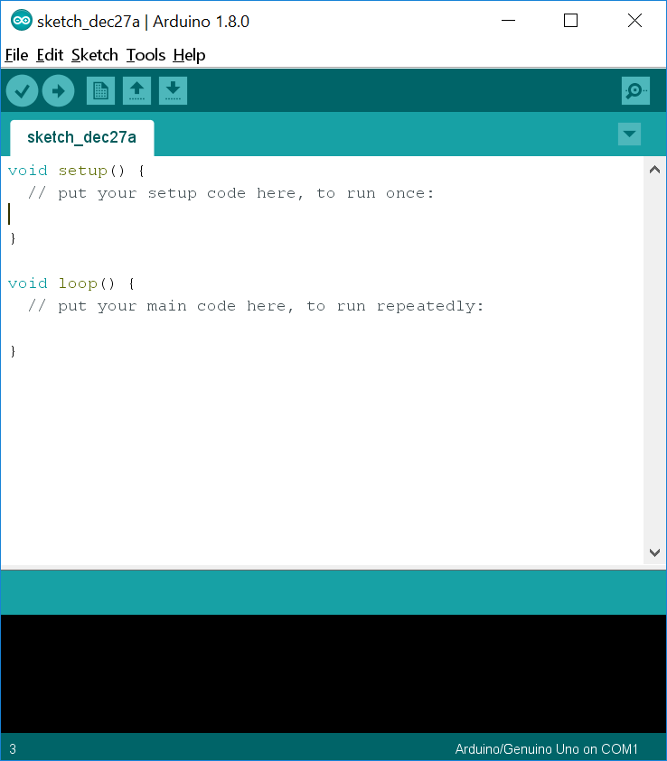
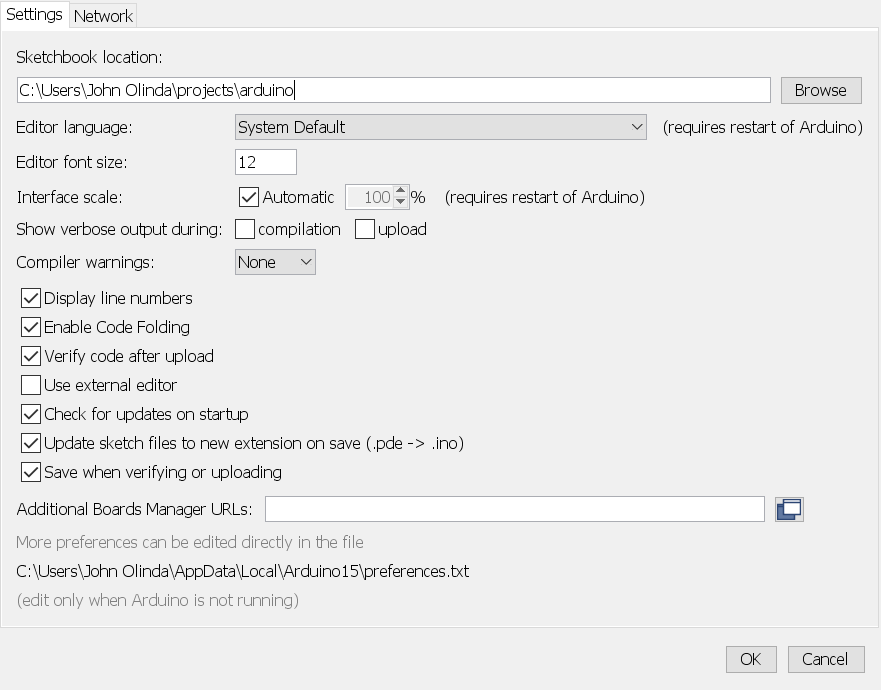
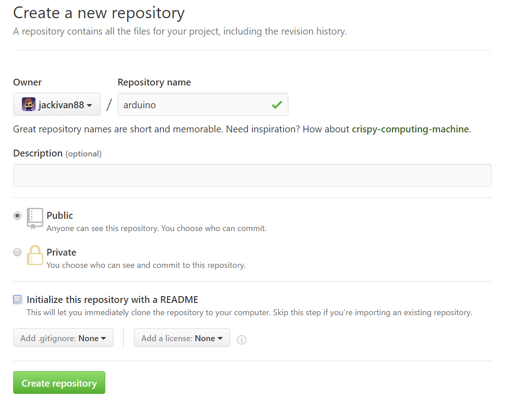

Arduino IDE 
============

In this unit we will be programming Arduino Uno devices using the
Arduino IDE. IDE stands for Integrated Development Environment. Although
you can program these devices using other tools, we will use the
official tool. Once you\'ve mastered it, you are welcome to use other
tools that you might prefer.\

Checkpoint 1: Download and Install the Arduino IDE
--------------------------------------------------

If you haven't already done so, install the Arduino IDE from the Windows Store.
You can use the default options. Once you\'ve installed it, open it. You should
see something like this:



This is the basic skeleton for an Arduino program. As you can see, there
are two sections. The first is for code you only want to run when the
Arduino boots up. The second is for the code you want to run as long as
the Arduino is powered on.\

<p class="checkpoint">Raise your hand and have Mr. Olinda verify this checkpoint.</p>

Checkpoint 2: Connect Your Arduino 
----------------------------------

Unpack your Arduino Uno and your USB-A to USB-B cable.
Once you have them, quit the Arduino IDE and connect the Arduino Uno to
your computer using the cable. You should see a small green LED blink
several times when you plug it in, and you\'ll see an orange LED as
well.

Open the Arduino IDE and go to the Tools menu. Hover your mouse over the
Ports submenu and then choose the COM port that shows the Arduino Uno
attached to it.\

<p class="checkpoint">Raise your hand and have Mr. Olinda verify this checkpoint.</p>

Checkpoint 3: Edit Your Preferences 
-----------------------------------

Open Git Bash and navigate to your OneDrive folder. Then use `git init` to create a 
repository called `cspProjects`. This is where your work for the second semester should 
be stored. Create an `arduino` directory in that folder.

Go to the File menu and open the editor preferences (you can also get
here by pressing Ctrl+Comma). First, change the default location of your
sketchbook to your new `cspProjects/arduino` folder. Then enable code
folding and line numbers.



Once you\'ve done this, press OK. Quit the Arduino IDE and reopen it.\

<p class="checkpoint">Raise your hand and have Mr. Olinda verify this checkpoint.</p>

Checkpoint 4: Bare Minimum 
--------------------------

You should have the empty program on your screen. Go ahead and compile
it by pressing the check symbol (or Ctrl+R) which will make sure your
program is free of errors. This doesn\'t mean your program does anything, it
just means that it doesn\'t have syntax errors. You should get a message
similar to the following (I compiled and uploaded my program to a MEGA
2560, not an Uno) when it finishes in the console at the bottom of the
window:

```
Sketch uses 656 bytes (0%) of program storage space. Maximum is 253952 bytes.
Global variables use 9 bytes (0%) of dynamic memory, leaving 8183 bytes for local variables. Maximum is 8192 bytes.
```

This just tells you how much of the Arduino\'s storage your program uses
as well as how much memory it will use. Now, upload it to your Arduino.
The Arduino won\'t do anything since it\'s an empty program, but you
should get a simple message in the console telling you what happened:

```
Sketch uses 656 bytes (0%) of program storage space. Maximum is 253952 bytes.
Global variables use 9 bytes (0%) of dynamic memory, leaving 8183 bytes for local variables. Maximum is 8192 bytes.
```

It\'s basically the same. However, if you have any errors, those will
also appear here. Go back to your settings and check the boxes for
compilation and upload after the phrase: \"Show verbose output during:\"
and repeat this checkpoint to see more detail about what\'s going on in
the background.\

Finally, save your program as \"bareMinimum\" in your Arduino project
folder. Then `git add` and `git commit`. Make sure your commit message
follows the Seven Rules.\

<p class="checkpoint">Raise your hand and have Mr. Olinda verify this checkpoint.</p>

Checkpoint 5: Git Remote 
------------------------

Now you need to link your local Git repository to a remote repository on
GitHub. Go to GitHub and create a new repository called \"cspProjects\".
Make sure your capitalization matches mine.\



Then add this new remote repository to your local repository so that you
can save your work to GitHub. Copy the link from the Clone or download button. Then, type the following command,
replacing "link" with the link to your repo:\

`git remote add origin link`

Then type:\

`git push -u origin master`

You should get a confirmation message, but if you get an error, be sure
to read the instructions in the error message. You must understand that
Git repositories can exist locally and remotely, and can be both at the
same time. Almost all repositories in this class will be both local and
remote since it allows you to have a backup of your work, but you can
create a local repository which exists only on your computer if you
want.\

<p class="checkpoint">Raise your hand and have Mr. Olinda verify this checkpoint.</p>
